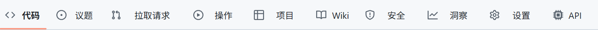
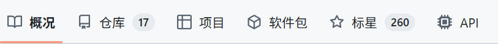

# [GitHub API Button]()

> 在 GitHub 仓库导航栏添加 API 按钮，并在侧边栏显示仓库/用户 created_at、updated_at 信息

## 🌟 功能列表
- 导航栏添加 API 按钮
  - 仓库页面 
    
  - 用户主页 
    
- 侧栏添加 created_at、updated_at 信息
  - 仓库页面 
    
  - 用户主页 
    

## 💻 安装指南

- 安装用户脚本管理器：
    - 推荐：[Tampermonkey](https://www.tampermonkey.net/)
- 选择脚本安装源：
    - [GitHub 源](https://github.com/Jursin/GitHub-API-Button/raw/refs/heads/main/main.js)
    - [GreasyFork 源](https://update.greasyfork.org/scripts/546506/GitHub%20API%20Button.user.js)
- 刷新页面后，脚本即可生效

## 🤝 参与贡献
- Fork 本项目
- 提交更改
- 推送到远程仓库
- 创建 Pull Request
- 等待审核后合并